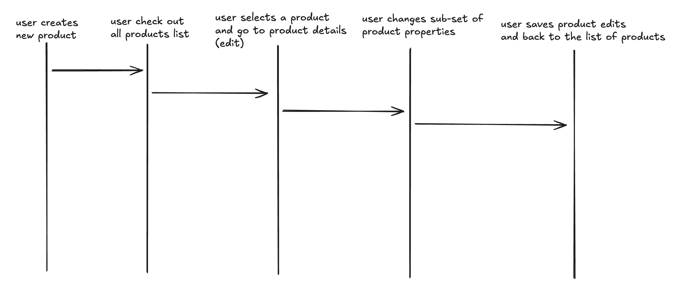

# Product Requirements Document

## Goals / Vision

- мати графічний інтерфейс додатку на платформі iPadOS для продавців
- application має працювати без інтернету
- (optional) мати графічний інтерфейс у додатку на платформі iOS для адміністратора
- (optional) application може синхронізуватися по мережі Internet (через окремий back-end)

## MVP v1

### Main User Workflow

### Requirements

1. User може шукати Product за назвою товару або за назвою будь-якої властивості Product
2. User может створити товар
3. User може деактивувати існуючий товар
4. User може редагувати інформацю про товар
TBD to validate possible requirements with @dnal01
5. User може створити декілька Product одночасно OR User може створити декілька варіантів одного Product (напр. Картопля кругла червона та квадратна чорна.)
6. Такі властивості Product як Amount & Total Price мають рахуватися у системі автоматично (напр. based on одиниця виміру / measurement)
7. User має керувати кількістю товарів на складі
    - напр. Залишки, Додання при постачанні, Списання при продажам, Ручне / автоматичне списанням, Інвентаризація
8. Система має автоматично перераховувати такі властивості Product як (i) Собівартість, (ii) Націнка & (iii) Ціну продажу після наступних операцій: Постачання, Списання, Інвентаризації.
9. User може редагувати властивість Product таку як (i) Термін придатності товарів
10. Деактивовані Entities не мають відображатися за default у Order, Promo, Product and Delivery entities.

- Потрібна синхронізація та зберігання даних на сервері.

### Entities

There are main product entities are defines the scope of product on the MVP v1 phase:

- Товари / Product
- Клієнти / Customer
- Персонал / User
- Акції / Promo
- Рахунок / Account
- Постачальники / Vendor
- Замовлення / Order
- Постачання / Delivery

Product entity має такі характеристи:

- Назва
- Опис
- Одиниця виміру
- Категорія
- Виробник
- Бренд
- ~~Групування за~~
- Тип
- Варіанти
- Ціна закупівлі
- Середня субіварітсть
- Штрихкод
- Фото
- Назва опції
- Значення опції
- Кількість
- shelf life

Customer entity має такі характеристи:

- first name
- last name
- phone number
- email address

User entity має такі характеристи:

- first name
- last name
- phone number
- email address
- role
- salary
- working schedule
- worked hours / days
- loging log ?
- actions taken in the system?

Promo entity має такі характеристи:

- products
- discount

Account entity має такі характеристи:

- type
- current amount
- currency
- opening date
- closing date
- commission / deduction

Vendor entity має такі характеристи:

- company name
- address
- phone number

Order entity має такі характеристи:

- time
- client
- employee
- discount
- Promo
- total price
- products
- price for each product
- payment status
- return status
- order status

Delivery entity має такі характеристи:

- vendor
- products
- product amount
- product cost
- total cost
- status
- time

## MVP v2

Requirements:

- Приймати сигнал по блютуз від сканера штрих кодів (Technical research is needed).
- Добавити безготівковий метод оплати (кредитними картками) при закритті замовлення.
  - Мати підтримку лише оплати карткою.
- Створення нової доменної моделі клієнти із властивостями та поведінкою
- Відображати статистику коштів окремо готівкового та безготівкового рахунків, або поєднану статистику готівкового та безготівкового рахунку
- Налаштовувати місячні автоматичні транзакції: витрати та доходи.
  - Оплата аренди, зарплати, податків, банківських зборів.
- Групувати варіанти за опціями при їх модифікації (обговорити коли буде спиок опцій).
